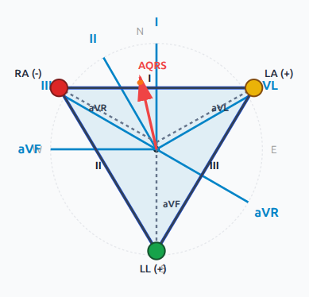
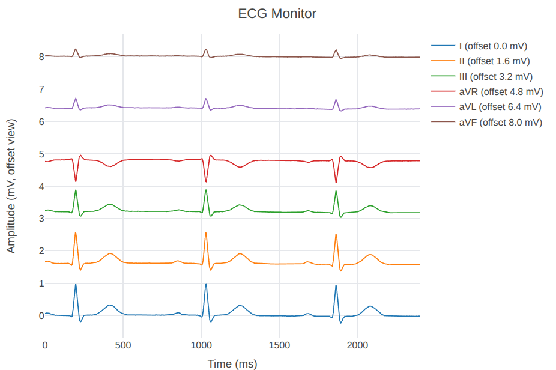

# ECG Axis Lab

ECG Axis Lab is an interactive playground for understanding frontal ECG geometry.
It is built for teaching, visual intuition, and experimentation with lead projections.

This project is educational and non-diagnostic.

## Repository Status

This repository is highly experimental.

- APIs, behaviors, and UI may change without backward compatibility.
- Some workflows are intentionally prototype-grade.
- Long-term maintenance is not guaranteed, and updates will likely be infrequent.

## Why It Is Useful

- See how lead projections change as the frontal vector changes
- Compare waveform behavior with geometric interpretation in real time
- Explore Einthoven triangle and augmented leads without clinical complexity
- Use a monitor-style teaching mode with play, pause, and timeline scrub

## Highlights

- Upload CSV/JSON ECG data
- Run built-in demos (single lead, Einthoven, frontal six, full twelve)
- Reconstruct frontal vector angle and magnitude
- Visualize the frontal plane with AQRS direction and trajectory
- Teach with a fixed-reference ECG monitor view

## Teaching Mode (Monitor Style)

Teaching mode is designed like a monitor:

- Fixed time axis and fixed reference grid
- Signal evolves over time
- Fixed NOW marker (playhead)
- Play/Pause control
- Manual timeline slider for scrubbing through the signal

This makes the waveform timing consistent with the animated heart activity panel.

## Screenshots

### Frontal Geometry View



### ECG Monitor View



## Quick Start

### Prerequisites

- Python 3.11+
- Miniconda
- Node.js 18+
- npm

### 1) Backend

```bash
cd apps/api
conda env create -f environment.yml
conda activate ecg-axis-lab
pytest tests/
uvicorn app.main:app --reload --port 8000
```

Backend is available at:

- http://localhost:8000
- http://localhost:8000/docs

### 2) Frontend

```bash
cd apps/web
npm install
npm run dev
```

Frontend is available at:

- http://localhost:5173

## API Overview

Core endpoints:

- `POST /api/reconstruct/frontal`
- `POST /api/reconstruct/summary`
- `POST /api/simulate`
- `GET /api/demos`
- `GET /api/demos/{demo_id}`

Utility endpoints:

- `GET /health`
- `POST /api/parse/csv-waveform`
- `POST /api/parse/json-waveform`

## Project Layout

```text
ecg-axis-lab/
├─ apps/
│  ├─ api/
│  └─ web/
├─ data/
├─ docs/
├─ notebooks/
└─ README.md
```

## Tech Stack

Backend:

- FastAPI
- NumPy / SciPy
- Pandas
- Pydantic
- pytest

Frontend:

- React + TypeScript
- Vite
- Tailwind CSS
- Plotly.js
- Zustand

## Scope and Limits

Included:

- Geometric interpretation and educational simulation
- Multi-lead waveform visualization
- Frontal vector estimation

Not included:

- Automated diagnosis
- Rhythm/pathology classification
- Clinical decision support

## Contributing

Contributions are welcome.

Before opening a large PR, please open an issue first to discuss scope because this repository may receive limited maintenance updates.

Typical areas for contribution:

- Better educational presets
- Additional visualization modes
- UI/UX refinements for teaching workflows
- Improved docs and examples

## License

See LICENSE for details.
